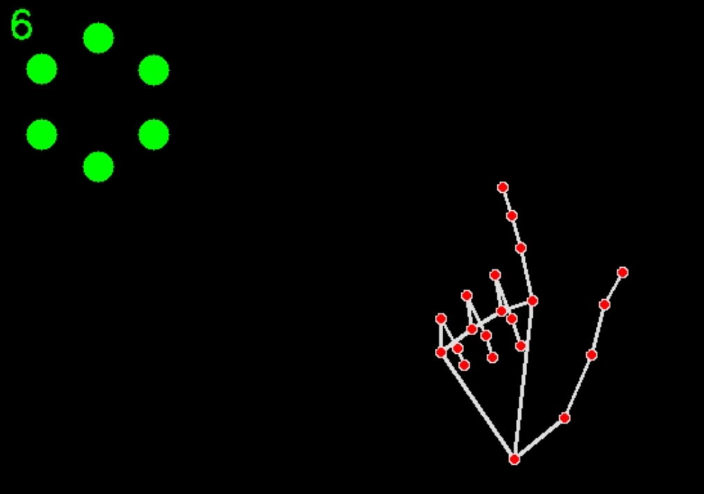

# Hand Action Recognition

이 프로젝트는 OpenCV와 MediaPipe를 활용하여 웹캠 영상에서 손 동작을 인식하고, 특정 손가락 제스처에 따라 상태를 관리하는 Python 애플리케이션입니다.



## 주요 기능

- 웹캠을 통해 실시간으로 손을 인식
- 손가락의 움직임(접기, 펴기, 엄지/검지 조합 등)을 이벤트로 감지
- 총알, 장전, 방아쇠 등 상태를 시뮬레이션하는 HandState 클래스 제공

## 폴더 구조

```
src/
  capture.py   # 손 인식 및 이벤트 감지 로직
  main.py      # 프로그램 진입점
  types.py     # 이벤트 및 상태 관리 클래스
```

## 실행 방법

1. Python 3.8 이상 설치
2. 필요한 패키지 설치:
   ```bash
   pip install opencv-python mediapipe
   ```
3. 실행:
   ```bash
   python src/main.py
   ```

## 주요 의존성

- opencv-python
- mediapipe

## 설명

- `capture.py`: MediaPipe로 손가락 랜드마크를 추출하고, 동작을 분석하여 HandState에 이벤트를 전달합니다.
- `types.py`: 손가락 동작 이벤트(FingerEvent)와 상태(HandState)를 정의합니다. 총알, 장전, 방아쇠 동작을 시뮬레이션합니다.
- `main.py`: HandState 객체를 생성하고, 손 인식 루프를 시작합니다.

## 참고

- MediaPipe Hands: https://google.github.io/mediapipe/solutions/hands.html
- OpenCV: https://opencv.org/

